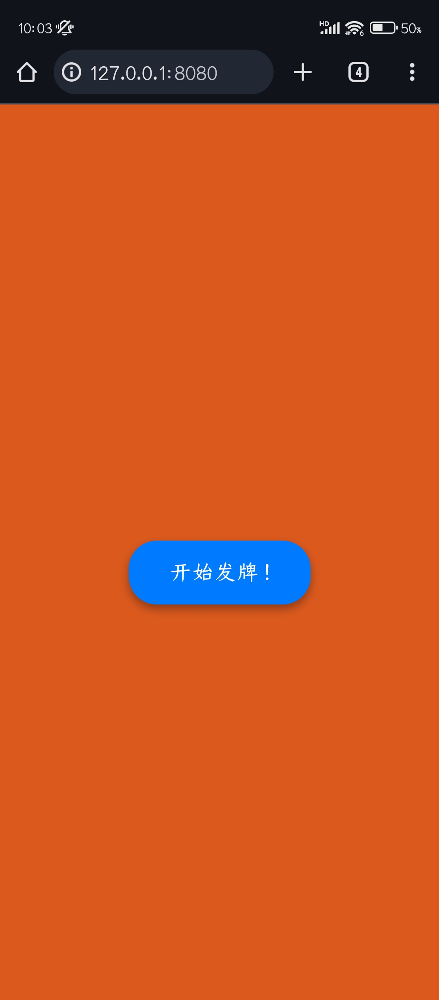
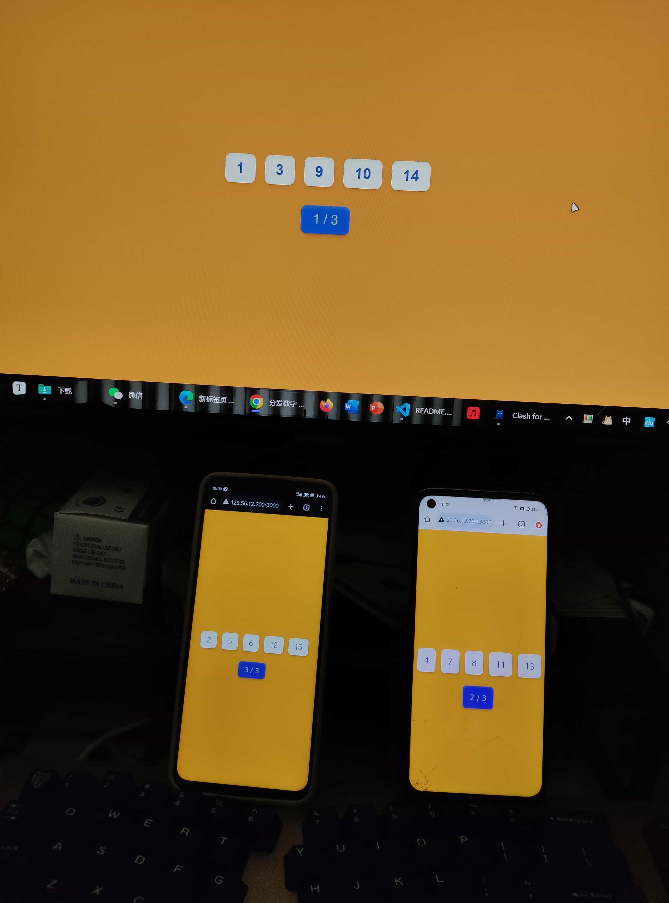
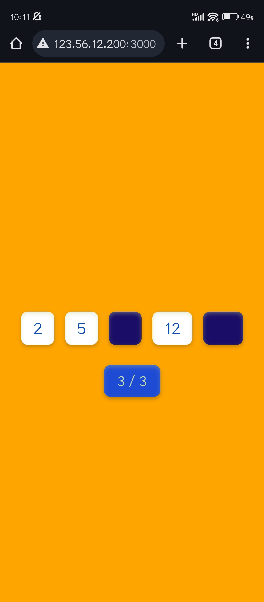

# sendnums

___

最近几个月台球打的挺多的, 有一种三人台球的简单玩法是 :  给出 1-15 的 15 张扑克牌, 与中八的 15 颗球对应. 每人随机抽取五张扑克, 玩家需要狙击掉不属于自己的牌而保留自己的牌到最后就能获胜, 每打掉一颗球, 其对应牌号的拥有者需要亮出此牌, 五张牌全被打掉算淘汰. 玩家即可以打他人的球, 也能打自己的球入袋不算犯规 ( 为了更好的衔接或者纯运气差 ) , 最重要的就是不要泄露自己的牌 !

---

### V 1 : python 命令行

有次进球馆发现就没牌了, 只得自己在手机的 termux 命令行里临时用 python 写了个简单的命令行发牌程序. 
- 发牌过程 : 玩家 a 回车, 显示牌号, 记住或拍照, 再回车, 清屏, 人走开. 稍后玩家 b 和 c 执行同样的流程. 
- 实现 : 初始创建一个乱序的栈, 每次弹出五个数. 见于 sn_v1.py 这样从功能上实现了牌的正确分发和保密, 但还是太简陋了


---

### V 2 : 本地网页

过了几天觉得命令行没意思, 于是改成了 html 的静态网页, 每次打球前只需将自己手机作为 http 服务器, 打开网页就行. 而发牌机制和 v1 完全一样, 只是用点击按钮的方式替代回车. 这一版的进步之处在于 :
- 网页界面更加美观, 视觉效果更好
- 避免在手机上执行 python 代码 ( 并不是每个人设备上都有 python 环境 ) . html 文件一般都可以点击在浏览器打开从而正确渲染出来 ( 当然也可以作为 http 服务端再本地打开 )




### V 3 : 云服务器

以上发牌方法的缺点就是, 所有玩家需要在一台手机上查看自己的牌, 要么拍照要么就强记自己的数字, 如果能在自己的手机上就得到牌显然会有更好的体验. 所以今天我又做了 v3 版本, 仍然是网页形式, 但用 node.js 做了后端效果.
- 用法 : 每个玩家只需访问一段 URL , 云服务器就会把牌发到每名玩家的手机里. 
- 实现 : 后端监听按钮的点击, 每点击一次, 栈就弹出五个数字到对应的设备上 ( 而不会给到其他设备 ), 所以三个人在各自设备上都点击一次按钮就能获得初始栈里的 15 个数字. 每拿到牌都会提醒这是 1 / 3 , 2 /3 还是 3 / 3 , 这样避免了不同批次牌的混杂.

- 优点 : 自己的牌在自己手机上, 不用担心忘记. 操作上相较于 v1 和 v2 也更加便捷. 如果某个球被打掉了, 玩家可点击对应按钮, 其颜色变成深蓝色, 表示 G 了 

部署服务 :

``` shell

git clone https://github.com/Daleveral/sendnums.git

cd ./sendnums/sn_v3

# 确认已经安装好了 node.js 环境和 npm !
# 查看 node 和 npm 版本 :
node -v
npm -v

# 如果没有, 则安装 :
# CentOS :
yum install nodejs  npm -y

# Debian / Ubuntu :
apt install nodejs npm -y

# 必要组件
npm install http fs express

# 作为 http 服务端, 运行网页 : 
node server.js  
# 默认端口是 3000 , 记得在安全组里开放
# 服务在退出会话后就中断了

# 在后台持续运行, 输出反馈到 out.txt 中 :
nohup node server.js > out.txt 2>&1 &

# 要中断后台服务, 则查询其 PID 然后 kill 掉
ps aux | grep node

```



